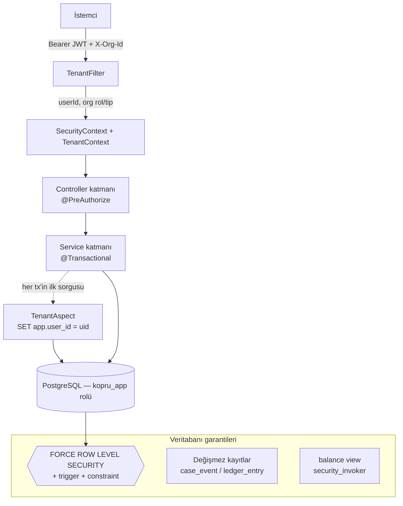

# Köprü — Backend & Veritabanı Kod İnceleme Raporu

*Diş Laboratuvarı ↔ Klinik Platformu · `tr.kopru` · Spring Boot 3.3.5 / Java 21 / PostgreSQL 16*
*İnceleme tarihi: 09.09.2026 · Kapsam: `src/main` (101 Java dosyası, ~4.356 satır) + `db/migration` (V1–V6) + testler*

---

## 1. Özet

Köprü, bir diş laboratuvarı ile klinikler arasındaki **çok-çoka** iş akışını yöneten bir backend'tir: vaka (case) yaşam döngüsü, fiyat mutabakatı, kargo takibi ve cari hesap. Projenin en dikkat çekici yanı, **güvenliği tek bir katmana değil, veritabanına kadar itmiş olması**. Hasta gizliliği, iş kuralları ve denetim izi büyük ölçüde PostgreSQL seviyesinde (RLS, trigger, constraint) garanti altına alınmış; uygulama katmanı bunları tekrar eden değil, tamamlayan bir rol üstlenmiş.

Genel değerlendirme: **mimari olarak olgun, savunma katmanları iyi kurgulanmış, test edilebilir bir proje.** Aşağıda hem güçlü yönler hem de üretime geçmeden önce ele alınması gereken noktalar kod referanslarıyla birlikte veriliyor.

---

## 2. Teknoloji Yığını

| Katman | Teknoloji |
|---|---|
| Dil / Runtime | Java 21 |
| Çatı | Spring Boot 3.3.5 (Web, Data JPA, Security, Validation) |
| Veritabanı | PostgreSQL 16 (`pgcrypto`, `citext`, `btree_gist`) |
| Migration | Flyway (`V1`..`V6`, tek doğruluk kaynağı) |
| Kimlik | JWT (jjwt 0.12.6), BCrypt |
| DTO eşleme | MapStruct 1.6.3 |
| Boilerplate | Lombok |
| Test | Testcontainers (gerçek PG 16) + RestAssured |

---

## 3. Mimari Genel Bakış



Kod, **domain'e göre paketlenmiş** (`domain/user`, `org`, `partnership`, `catalog`, `caze`, `ledger`) — teknik katmana göre değil. Bu, özelliklerin tek bir yerde toplanmasını sağlayan iyi bir tercih. Ortak altyapı `common/` (hata modeli), `config/` (güvenlik, JWT) ve `tenant/` (çok kiracılılık) altında.

---

## 4. Güçlü Yönler

### 4.1 Katmanlı hasta gizliliği (en kritik gereksinim)
Laboratuvarın gerçek hasta kimliğini **hiçbir koşulda** görmemesi üç ayrı katmanla garantilenmiş:

1. **Şema tasarımı:** `"case"` tablosunda `patient_id` alanı *yok*. İlişki ayrı bir `case_patient_link` tablosunda tutuluyor (`V2__tables.sql`).
2. **Veritabanı (RLS):** `patient` ve `case_patient_link` için politikalar yalnızca `app.user_clinic_orgs()` içindeki klinik kullanıcılarına satır döndürüyor (`V4`). `FORCE ROW LEVEL SECURITY` sayesinde uygulama katmanında bir sorgu hatası olsa dahi lab kullanıcısına **0 satır** döner.
3. **API (serialize):** Ayrı `CaseLabMapper` / `CaseClinicMapper` var; lab yanıtına hasta nesnesi hiç girmiyor (`DentalCaseService.serializeCaseForCurrentOrg`).

Bu "derinlemesine savunma" yaklaşımı, tek bir noktanın hata vermesi durumunda bile sızıntıyı engelliyor — projenin en güçlü tarafı.

### 4.2 Çift veritabanı rolü + tenant bağlamı
- Flyway migration'ları yetkili `postgres` rolüyle, uygulama ise **`BYPASSRLS` yetkisi olmayan** kısıtlı `kopru_app` rolüyle bağlanıyor (`docker/init.sql`, `application.yml`). Bu, RLS'in gerçekten devrede kalmasının önkoşulu — doğru yapılmış.
- `TenantAspect`, her `@Transactional` metodun **ilk** sorgusu olarak `set_config('app.user_id', :uid, true)` çalıştırıyor. `true` (yerel/transaction-scope) bayrağı, HikariCP havuzundan gelen bağlantıların birbirine bağlam sızdırmaması için kritik — doğru seçilmiş.
- `init.sql`'de `DELETE` yetkisi kasıtlı olarak verilmemiş ("kayıtlar silinmez, pasifleştirilir") — tasarım niyetiyle uyumlu.

### 4.3 Veritabanı tek doğruluk kaynağı
`ddl-auto=validate` ile Hibernate'in şemaya dokunması engellenmiş. Native enum'lar, `EXCLUDE USING gist` çakışma engelleri, audit trigger'ları ve RLS politikaları elle yazılmış migration'larda. Bu, "kod ile şema tutarsızlığı" sınıfındaki hataları baştan eler.

### 4.4 Versiyonlu fiyat mutabakatı (yarış koşulu çözümü)
`CaseStateMachine`, klasik "iki taraf aynı anda onaylıyor" sorununu `fiyat_versiyon` ile çözüyor: fiyat her değiştiğinde/karşı teklifte versiyon artıyor ve önceki onaylar (`onay_klinik_versiyon`, `onay_lab_versiyon`) sıfırlanıyor. `ONAYLANDI`'ya geçiş yalnızca **iki onay da güncel versiyonda** olduğunda gerçekleşiyor. `klinikOnayla`/`labOnayla` isteğe bağlı `fiyatVersiyon` alıp uyuşmazlıkta `VERSION_MISMATCH` fırlatıyor. Test 7 ve Test 8 tam olarak bunu doğruluyor.

### 4.5 Değişmez denetim izi ve cari hesap
- `case_event` ve `ledger_entry` üzerinde `BEFORE UPDATE OR DELETE` trigger'ları mutasyonu tümden yasaklıyor (`V3`). Düzeltme, silme değil `DUZELTME` tipi kayıtla yapılıyor — muhasebe açısından doğru desen.
- Teslimat borcu **idempotent**: `teslimEt` vakayı `SELECT ... FOR UPDATE` ile kilitliyor (`findByIdForUpdate`), `idx_unique_case_borc` partial unique index mükerrer borcu engelliyor ve ikinci çağrı `409 ALREADY_DELIVERED` dönüyor (Test 9).
- Bakiye, `security_invoker = true` olan `balance` view'ı üzerinden — yani view sorgulayan kullanıcının RLS'iyle çalışıyor, ayrıcalık kaçağı yok (`V5`).

### 4.6 Zengin veritabanı kısıtları
FDI diş numarası doğrulaması (`is_valid_fdi_array`), birim tutarlılığı (`DIS` ↔ `dis_numaralari` kardinalitesi), fiyat tarih aralığı çakışması (`btree_gist` exclusion constraint), KDV hesap doğruluğu (`chk_ledger_borc_rules`), `ara_toplam = birim_fiyat * adet` — iş kuralları veritabanında da kilitlenmiş.

### 4.7 Fiyat anlık görüntüsü (snapshot)
`case_item.birim_fiyat` vaka oluşturulurken donduruluyor; sonradan fiyat listesi değişse bile vaka tutarı değişmiyor (Test 10). Finansal tutarlılık için önemli.

### 4.8 Atomik vaka numarası
`nextCaseNumber`, `INSERT ... ON CONFLICT DO UPDATE ... RETURNING` ile tek atomik sorguda üretiliyor — eşzamanlı vaka oluşturmada numara çakışması olmaz.

### 4.9 Gerçek veritabanıyla test
İki test sınıfı da Testcontainers ile **gerçek PostgreSQL 16** üzerinde koşuyor (mock değil). RLS izolasyonu (6 test) ve iş kuralları/constraint'ler (10 test) kapsanmış. RLS gibi tamamen veritabanına bağlı bir davranışı H2 ile test etmek imkânsız olurdu; bu doğru tercih.

---

## 5. Dikkat Edilmesi Gereken Noktalar

Aşağıdakiler kritiklik sırasına göre; hiçbiri "proje çalışmıyor" düzeyinde değil, üretim sertleştirmesi ve doğruluk niteliğinde.

### 5.1 Rol çözümü aktif organizasyon bağlamını yok sayıyor — *orta/yüksek*
`CaseStateMachine.getUserRolesInCase()` iki sorun içeriyor:

```java
List<Membership> memberships = membershipRepository.findAll();   // TÜM üyelikler belleğe
for (Membership m : memberships) { ... }
```

1. **Bağlam:** Kullanıcının rolleri, `TenantContext.getOrgId()` (yani `X-Org-Id`) dikkate alınmadan, ortaklığın **her iki tarafındaki** tüm üyeliklerinden toplanıyor. Hem lab hem klinikte üyeliği olan bir kullanıcı, hangi org başlığıyla gelirse gelsin her iki tarafın yetkilerini birden kazanır. Yetki, işlemin yapıldığı aktif org'a göre daraltılmalı.
2. **Performans:** `findAll()` sistemdeki tüm üyelikleri çekip Java tarafında filtreliyor. RLS bunu görünürlük açısından sınırlasa da, `findByUserId...` ile hedefli sorgu hem doğru hem ölçeklenebilir olur.

### 5.2 `payments` uç noktasında yetki kısıtı yok — *orta*
`LedgerController`'da `POST /adjustments` `@PreAuthorize("hasAnyRole('LAB_ADMIN','KLINIK_ADMIN')")` ile korunuyor, ancak `POST /payments` (tahsilat) **hiçbir rol kısıtı taşımıyor** — ortaklığa üye herkes (ör. `ASISTAN`, `LAB_TEKNISYEN`) tahsilat kaydı girebilir. Kasıtlı değilse burada da rol kısıtı beklenir.

### 5.3 Varsayılan sırlar depoda — *üretim öncesi zorunlu*
`application.yml` ve `.env.example` içinde çalışan bir varsayılan `JWT_SECRET`, `docker-compose.yml`'de `postgres/postgres`, `init.sql`'de `kopru_app_pass` var. README bunu not etmiş; yine de üretimde tümü ortam değişkeninden gelmeli ve depodaki varsayılan JWT anahtarı gerçek bir sırla değiştirilmeli. `logging.level.org.hibernate.SQL: DEBUG` de üretimde kapatılmalı.

### 5.4 Olası N+1 ve lazy yükleme — *düşük*
`getCases()` lab tarafında `findAllFiltered` ile `items` fetch edilmeden dönüyor; `labMapper.toResponse` içinde kalemler lazy yükleniyor. `@Transactional(readOnly=true)` sayesinde `LazyInitializationException` oluşmaz, ancak vaka başına ek sorgu (N+1) doğar. Klinik tarafında ayrıca vaka başına `findByCaseIdWithPatient` çağrısı var. Liste uç noktaları büyüdükçe toplu (batch) çekim düşünülmeli.

### 5.5 Vaka numarası yıl öneki ile dizi ayrışması — *düşük / iş kuralı*
Kod `{yıl}-{6 hane}` biçiminde ve dizi **ortaklık başına** artıyor, yıla göre sıfırlanmıyor. Yıl değişince önek değişir ama numara kaldığı yerden devam eder (ör. 2026'da 3 vakadan sonra ilk 2027 vakası `2027-000004`). İstenen davranış "her yıl 1'den başlasın" ise dizi anahtarına yıl da eklenmeli.

### 5.6 Küçük notlar
- `DentalCaseService.updateItems` `TASLAK` durumunda da `fiyat_versiyon`'u artırıyor; henüz onay olmadığı için zararsız, ama gereksiz.
- `createShipment` `yon` alanını vaka durumuyla ilişkilendirmiyor (serbest kayıt) — iş akışına bağlı olarak kabul edilebilir.
- `refresh` akışı eski token'ı `revoked` yapıp yeni çift üretiyor (rotation), ancak eski access token süresi dolana kadar (15 dk) geçerli kalır — JWT için beklenen davranış, yalnızca not.

---

## 6. Sonuç

Köprü backend'i, "güvenliği ve iş kurallarını veritabanına kadar indir" ilkesini tutarlı biçimde uygulayan, üzerinde düşünülmüş bir proje. Hasta gizliliği çok katmanlı, cari hesap ve denetim izi değişmez, fiyat mutabakatı yarış koşullarına karşı korunmuş ve tüm bunlar gerçek PostgreSQL üzerinde test edilmiş. Üretime geçmeden önce öncelik sırası: **(1)** rol çözümünün aktif org bağlamına bağlanması, **(2)** `payments` yetkilendirmesi, **(3)** sırların depodan çıkarılması. Bunlar giderildiğinde platform sağlam bir üretim temeline sahip olur.
